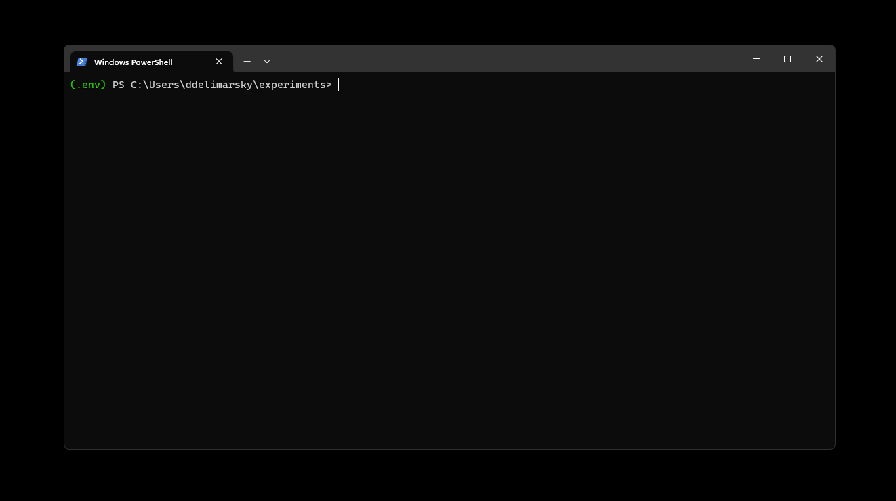
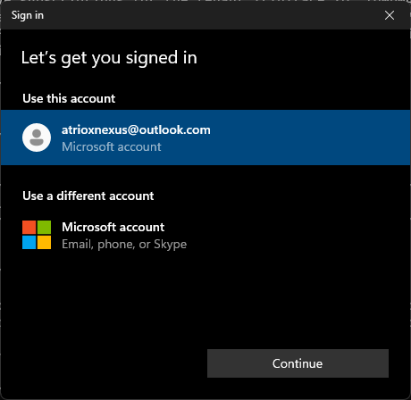
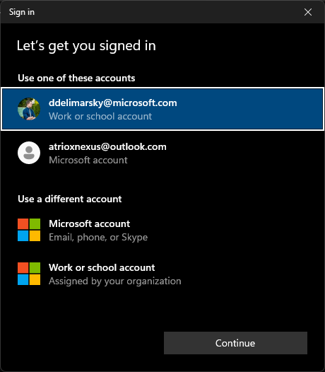
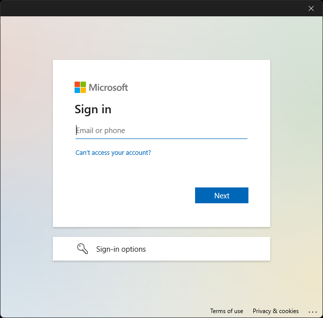
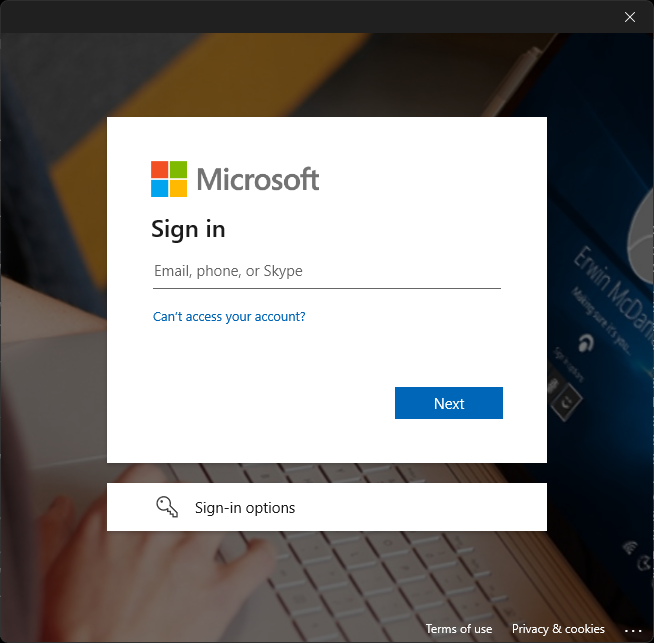

# Using MSAL Python with Web Account Manager

If you are building a Windows application, you might consider simplifying how users authenticate with the help of an _authentication broker_ - the [Web Account Manager](/windows/uwp/security/web-account-manager) (WAM).

>[!NOTE]
>WAM is only available on Windows 10 and above, as well as Windows Server 2019 and above.

To learn more about the benefits of using an authentication broker, refer to [What is a broker](/entra/msal/dotnet/acquiring-tokens/desktop-mobile/wam#what-is-a-broker) in the MSAL.NET documentation.

## Usage

To use the broker, you will need to install the broker-related packages in addition to the core MSAL from PyPI:

```bash
pip install msal[broker]>=1.20,<2
```

>[!IMPORTANT]
>If broker-related packages are not installed and you will try to use the authentication broker, you will get an error: `ImportError: You need to install dependency by: pip install "msal[broker]>=1.20,<2"`.

Next, you will need to instantiate a new [`PublicClientApplication`](xref:msal.application.PublicClientApplication) and set `allow_broker` to `True`. This will ensure that MSAL will try and communicate with WAM instead of popping up a new browser window.

```python
from msal import PublicClientApplication

app = PublicClientApplication(
    "CLIENT_ID",
    authority="https://login.microsoftonline.com/common",
    allow_broker=True)
```

You can now acquire a token by calling [`acquire_token_interactive`](xref:msal.application.PublicClientApplication.acquire_token_interactive) and specifying a parent window handle through `parent_window_handle`:

```python
result = app.acquire_token_interactive(["User.ReadBasic.All"],
         parent_window_handle=app.CONSOLE_WINDOW_HANDLE)
```

A parent window handle is required by WAM to ensure that the dialog is shown correctly on top of the requesting window. MSAL does not infer this directly due to the fact that there are many variables that might influence what window WAM needs to bind to, and developers building applications are best suited to decide what window that should be.

For console applications, MSAL makes it easy by offering an out-of-the-box solution to getting the window handle for the terminal - [`CONSOLE_WINDOW_HANDLE`](xref:msal.application.PublicClientApplication.CONSOLE_WINDOW_HANDLE). For desktop applications, additional work with the Windows API might be required to [get the window handle](/windows/apps/develop/ui-input/retrieve-hwnd). Helper packages, like [pywin32](https://pypi.org/project/pywin32/) can help with API calls.

Before executing your application, make sure that you configure the redirect URL for the desktop app:

>[!IMPORTANT]
>To use the Windows broker, your application needs to have the correct redirect URL configured in the Azure Portal, in the shape of:
>
>```bash
>ms-appx-web://microsoft.aad.brokerplugin/YOUR_CLIENT_ID
>```
>
>If the redirect URL is not configured, you will get a `broker_error` similar to `(pii). Status: Response_Status.Status_ApiContractViolation, Error code: 3399614473, Tag: 557973642`.

If configuration and instantiation was correct, once you run the application you should see the authentication broker kick in and allow the user to select the account they want to authenticate with.



Worth noting that if you switch to using broker-based authentication, if the user was previously logged in and the account tokens exist in the cache, calling [`acquire_token_interactive`](xref:msal.application.PublicClientApplication.acquire_token_interactive) will still result in a silent attempt to acquire a token from the cache first. To bypass this, you can provide a login hint via `login_hint`.

## Broker experience differences

Depending on the authority specified when instantiating [`PublicClientApplication`](xref:msal.application.PublicClientApplication), the broker user interface may be different.

### `/consumers`

Used for authenticating **only** with personal Microsoft accounts.



### `/common`

Used for authenticating with personal Microsoft accounts as well as work and school accounts.



### `/organizations`

Used for authenticating **only** with work and school accounts.



>[!NOTE]
>If `login_hint` is provided but the account is not yet registered in WAM, the hint will be automatically filled in the "Email or phone" field.

### `/TENANT_ID`

Used for authenticating **only** with work and school accounts within the specified tenant.



>[!NOTE]
>If `login_hint` is provided but the account is not yet registered in WAM, the hint will be automatically filled in the "Email or phone" field.
